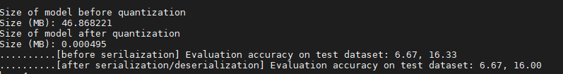

# post_training_quantization-
A module that enables post training quantization for a deep learning classification model 
## Setup
Set up the environment for using post training quantization by downloading pytorch 
(https://github.com/facebookresearch/detectron2/blob/master/INSTALL.md) 

## Running the Program
-m  or --model: selecting 1 of 12 pretrained models implemented in torchvision 
-c or --checkpoint: path for the checkpoint of the model that will go through quantization 
-d or --data: path for the data which the original model was built upon 
-n or --target: number of classes 
 
example of performing the post training quantization of a model built by a certain dataset 
```bash
python3 main.py -m resnet18 -c /ssd3/jhahn/ptq/model/saved_model/resnet18-model1.pth -d /ssd3/jhahn/ptq/data/imagenet_1k/ -n 1000
```
## Caution
In order to run this module the dataset should be in the same format as the following dataset 
https://s3.amazonaws.com/pytorch-tutorial-assets/imagenet_1k.zip

## Result


